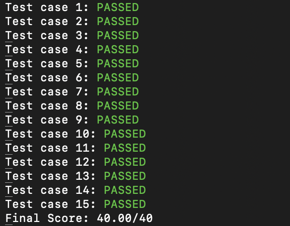

This directory contains two interactive tester programs to evaluate your program:

1. **interactive_tester.cpp** – Standard interactive tester (Without Load Balancing).  
2. **lb_interactive_tester.cpp** – Interactive tester with **Load Balancing** implementation.

#### Prerequisites
- g++ (supporting C++17 or later)

#### Compilation
To compile the programs, use the following commands:

For the standard interactive tester:
```bash
g++ -std=c++17 interactive_tester.cpp -o interactive_tester
```

For the load balancing interactive tester:
```bash
g++ -std=c++17 lb_interactive_tester.cpp -o lb_interactive_tester
```

#### Execution
- Without Load Balancing, in the script `DFS_test.sh`, replace `./lb_interactive_tester` with:
```bash
./interactive_tester
```

- With Load Balancing, use (default):
```bash
./lb_interactive_tester
```

#### Notes
- Use **lb_interactive_tester** only if the Load Balancing feature is implemented.

### Sample Test Results



Final Score: 40/40 - All test cases passed! :)
